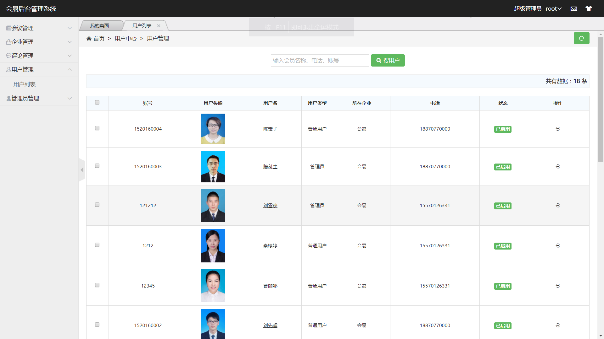
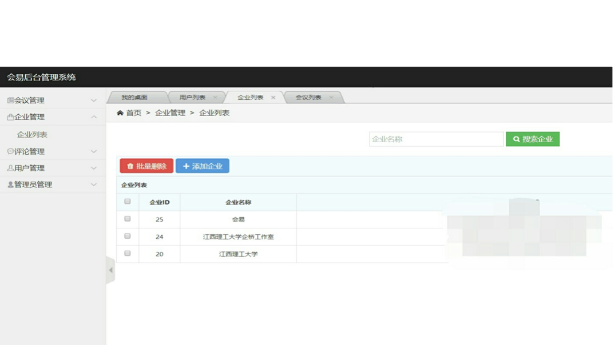

#  会易项目后台
===============

## 介绍
基于生物信息识别的会议签到系统（会易) 

    会易是一款集会议发布、与会人员签到，签到人员管理于一身的软件，其利用人脸识别技术和生物指纹识别技术，对参与会议的人进行识别从而进行签到，采用无线测距限制签到人员位置，保证了数据的准确性。用户通过会易可以查看到自己应该参加的会议，在会场范围之内仅需自己的一部手机便可完成签到，无需排队等候。管理员可通过会易发会议内容并且能实时管理会场人员，实时查看到已签到和未签到的人员，可及时通知还未到场的人，免于出现会议参与人不齐的状况，同时大大提高了工作效率。
    
    企业管理员注册的时候会有一个唯一的授权码，拥有授权码的企业才可以在会易上发布会议内容和管理签到人员。管理员可以通过创建一个新的会议，编辑该会议主要内容，包括会议内容和时间地点等，简单快捷，清晰明了。
    
    会易技术上的亮点为指纹识别、人脸识别和室内定位。在以往的签到方式中，过程冗长，效率低下，人们往往不愿意排队等候，现在通过一部手机，人们就可以快速完成签到了。并且
    通过此软件签到，可以有效避免代签和签完就离开会场的情况，必须是本人的指纹或者脸才能完成签到。

## 目录结构

初始的目录结构如下：

~~~
www  WEB部署目录（或者子目录）
├─application           应用目录
│  ├─common             公共模块目录（可以更改）
│  ├─module_name        模块目录
│  │  ├─config.php      模块配置文件
│  │  ├─common.php      模块函数文件
│  │  ├─controller      控制器目录
│  │  ├─model           模型目录
│  │  ├─view            视图目录
│  │  └─ ...            更多类库目录
│  │
│  ├─command.php        命令行工具配置文件
│  ├─common.php         公共函数文件
│  ├─config.php         公共配置文件
│  ├─route.php          路由配置文件
│  ├─tags.php           应用行为扩展定义文件
│  └─database.php       数据库配置文件
│
├─public                WEB目录（对外访问目录）
│  ├─index.php          入口文件
│  ├─router.php         快速测试文件
│  └─.htaccess          用于apache的重写
│
├─thinkphp              框架系统目录
│  ├─lang               语言文件目录
│  ├─library            框架类库目录
│  │  ├─think           Think类库包目录
│  │  └─traits          系统Trait目录
│  │
│  ├─tpl                系统模板目录
│  ├─base.php           基础定义文件
│  ├─console.php        控制台入口文件
│  ├─convention.php     框架惯例配置文件
│  ├─helper.php         助手函数文件
│  ├─phpunit.xml        phpunit配置文件
│  └─start.php          框架入口文件
│
├─extend                扩展类库目录
├─runtime               应用的运行时目录（可写，可定制）
├─vendor                第三方类库目录（Composer依赖库）
├─build.php             自动生成定义文件（参考）
├─composer.json         composer 定义文件
├─LICENSE.txt           授权说明文件
├─README.md             README 文件
├─think                 命令行入口文件
~~~

> router.php用于php自带webserver支持，可用于快速测试
> 切换到public目录后，启动命令：php -S localhost:8888  router.php
> 上面的目录结构和名称是可以改变的，这取决于你的入口文件和配置参数。

## 项目地址
1.  会易APP项目 [会易APP](https://github.com/li-fengjie/hui-yi-app)
2.  会易签到微信小程序 [会易签到](https://github.com/li-fengjie/hui-yi-miniprogram)
 
3.  会易项目后台 [会易](https://github.com/li-fengjie/hui-yi-server)

## 视频演示
1.  会易APP [会易APP](https://v.qq.com/x/page/u08847pwwy3.html)
2.  会易小程序 [会易签到](https://v.qq.com/x/page/g068032qqav.html)

## 界面展示

